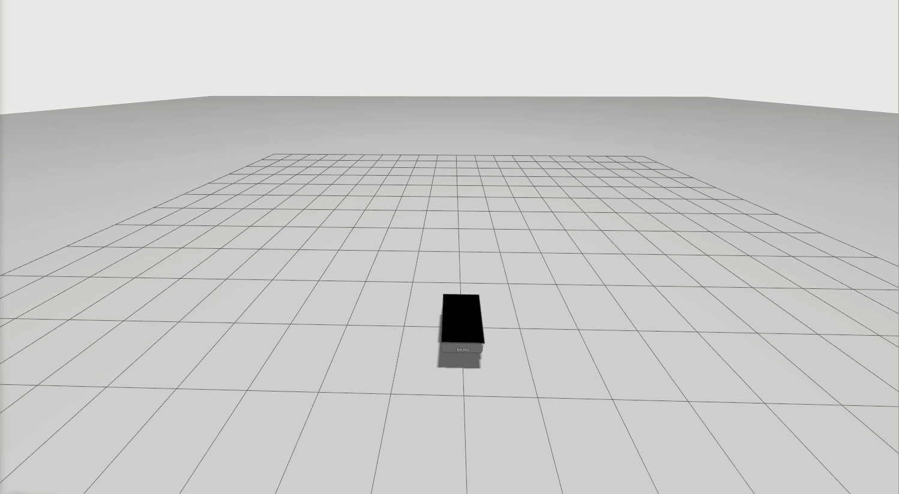

# Simple Line Follower

## About

This repository demonstrates a basic line-following robot which uses a Proportional-Derivative Controller. 

This ROS 2 package is used to demonstrate these examples :

- Code which is tough to test (Ex : [naive_line_follower.cpp](src/naive_line_follower.cpp))
- Code which is easy to test (Ex : [line_follower.cpp](src/line_follower.cpp))
- Basic unit-tests taking the line follower as an example (Ex : [test_line_follower_basic.cpp](test/test_line_follower_basic.cpp))
- Basic unit-tests taking the naive line follower as an example (Ex : [test_naive_line_follower.cpp](test/test_naive_line_follower.cpp))
- Good unit tests taking the line follower as an example (Ex : [test_line_follower_good.cpp](test/test_line_follower_good.cpp))


## Dependencies

- Ubuntu 22.04
- ROS 2 Humble
- Ignition Gazebo(Fortress)
- [bcr_bot](https://github.com/blackcoffeerobotics/bcr_bot)

## Installation

1. Clone this repository

    ```bash
    git clone git@github.com:ggupta9777/simple_line_follower.git
    ```

2. Clone bcr_bot

    ```bash
    git clone git@github.com:blackcoffeerobotics/bcr_bot.git
    ```

2. Install dependencies using `rosdep`:

    ```bash
    rosdep install --from-paths src -y --ignore-src
    ```

3. Build the packages with test config(**Note** : The `--cmake-args`` used above are to enable code coverage analysis)

    ```bash
    colcon build --symlink-install --cmake-args -DCMAKE_BUILD_TYPE=Debug   -DCMAKE_CXX_FLAGS="--coverage" -DCMAKE_CXX_OUTPUT_EXTENSION_REPLACE=ON
    ```

## Run instructions

1. Launch [bcr_bot](https://github.com/blackcoffeerobotics/bcr_bot/tree/ros2)

    ```bash
    ros2 launch bcr_bot gz.launch.py \
	    camera_enabled:=True \
	    stereo_camera_enabled:=False \
	    two_d_lidar_enabled:=True \
	    position_x:=0.0 \
	    position_y:=0.0  \
	    orientation_yaw:=0.0 \
	    odometry_source:=world \
	    world_file:=empty.sdf
    ```

2. Run the line follower node

    - Run the [line_follower_node](src/line_follower.cpp)

        ```bash
        ros2 run simple_line_follower line_follower_node --ros-args --params-file src/simple_line_follower/config/params.yaml
        ```
    - Run the [naive_line_follower_node](src/naive_line_follower.cpp)

        ```bash
        ros2 run simple_line_follower naive_line_follower_node --ros-args --params-file src/simple_line_follower/config/params.yaml
        ```

## Running Tests

- Run the test scripts(**Note** : The `--event-handler=console_direct+` argument is used to show the logs of the testing process)

    ```bash
      colcon test --event-handler=console_direct+
    ```
### Generate Code Coverage

1. Use [lcov](https://github.com/linux-test-project/lcov) to generate code coverage

    ```bash
    lcov --capture --directory build/ --output-file code_coverage_report.info
    ```    

2. Generate an HTML file to showcase the code coverage report

    ```bash
    genhtml code_coverage_report.info --output-directory html_code_coverage_report
    ```

3. Open the code coverage on your browser
    
    ```bash
    sensible-browser html_code_coverage_report/index.html
    ```

## Topics

- `/bcr_bot/cmd_vel` : This topic is used to publish velocity messages to the bot in Gazebo
- `/bcr_bot/odom` : This topic is used to obtain odometry information regarding the bot

## Demo

This is a demo of the bot following a line defined by the waypoints : `(0, 1, 0)` and `(5, 1, 0)`

